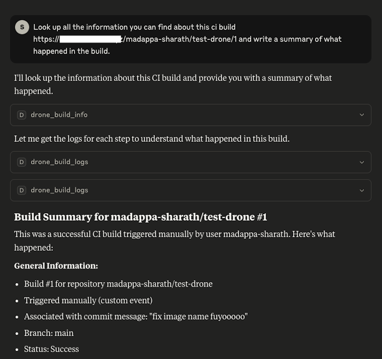
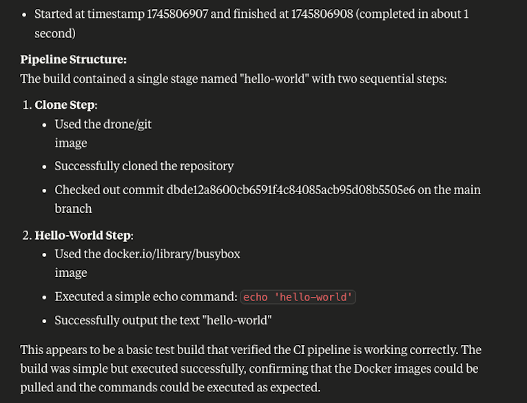

# drone-ci-mcp

An opinionated mcp server that exposes [drone.io](https://www.drone.io/) ci build information and logs as MCP. Will only support readonly features.

> [!WARNING]
> Still Under Active Development, use at your own risk

## Usage

### Launch the transport

```
npx -y drone-ci-mcp --access-token=<access-token-from-drone> --server-url=<url>
```

### Claude Settings

```json
{
  "mcpServers": {
    "drone-ci-mcp": {
      "command": "npx",
      "args": [
        "-y"
        "drone-ci-mcp",
        "--access-token=<token>",
        "--server-url=<url>"
      ]
    }
  }
}
```

### MCP Inspector

```shell
npx @modelcontextprotocol/inspector npx -y drone-ci-mcp --access-token=<token> --server-url=<url>
```

## Tools

### drone_build_info

Readonly tool that looks up a build information and returns the output as YAML.

Inputs:

1. repoSlug - The slug of the repository in drone. Combination of owner/org and repository name seperated by '/', i.e. owner/repo
2. buildNumber - The drone CI build number

Outputs:

Response from https://docs.drone.io/api/builds/build_info/ as Mardown + YAML

````markdown
# Build **1** in **<repo slug>**

```yaml
id: 1
repo_id: 5
trigger:<trigger>
number: 1
status: success
event: custom
action: ''
link: >-
  https://github.com/<commit-link>
timestamp: 0
message: <commit message>
before: dbde12a8600cb6591f4c84085acb95d08b5505e6
after: dbde12a8600cb6591f4c84085acb95d08b5505e6
ref: refs/heads/main
source_repo: ''
source: main
target: main
author_login: <username>
author_name: <name>
author_email: <email>
author_avatar: <avatar>
sender: madappa-sharath
started: 1745806907
finished: 1745806908
created: 1745806904
updated: 1745806907
version: 3
stages:
  - id: 1
    repo_id: 5
    build_id: 1
    number: 1
    name: hello-world
    kind: pipeline
    type: docker
    status: success
    errignore: false
    exit_code: 0
    machine: drone-runner-65d8dd8798-rf8xr
    os: linux
    arch: arm64
    started: 1745806907
    stopped: 1745806908
    created: 1745806904
    updated: 1745806908
    version: 4
    on_success: true
    on_failure: false
    steps:
      - id: 1
        step_id: 1
        number: 1
        name: clone
        status: success
        exit_code: 0
        started: 1745806907
        stopped: 1745806908
        version: 4
        image: drone/git:latest
        .....
```
````

### drone_build_info

Readonly tool that looks up a logs for a step.

Inputs:

1. repoSlug - The slug of the repository in drone. Combination of owner/org and repository name seperated by '/', i.e. owner/repo
2. buildNumber - The drone CI build number
3. stageNumber - The build stage number. Indicated by the field 'number' on a stage
4. stepId - The build step id. Indicated by the field 'step_id' on a step

Outputs:

Response from https://docs.drone.io/api/builds/build_logs/ as Mardown

````markdown
# Logs for step 2 in stage **1** of **1** build in **<repo slug>** repository

```shell
+ echo 'hello-world'
,hello-world
```
````

## Demo



